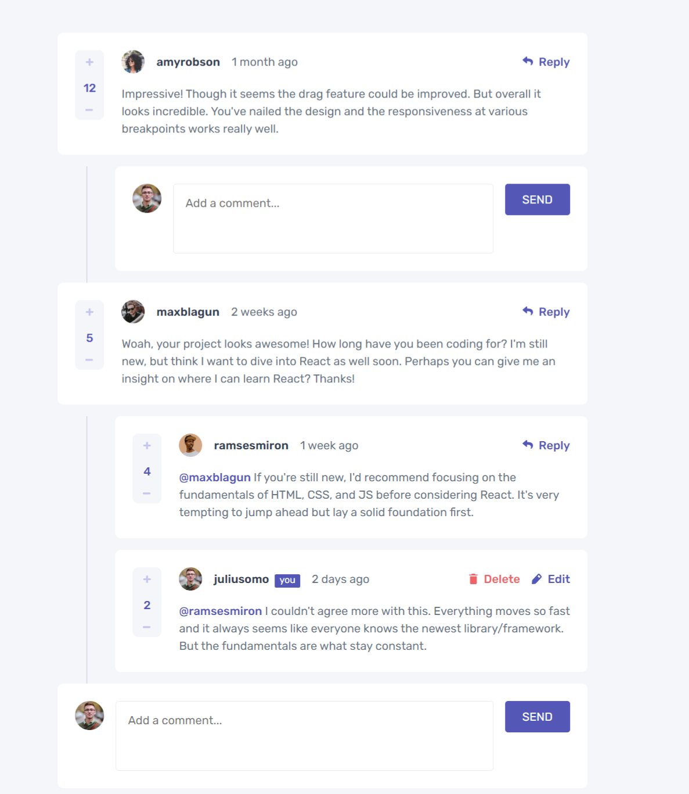

## Table of contents

- [Overview](#overview)
  - [The challenge](#the-challenge)
  - [Screenshot](#screenshot)
  - [Links](#links)
  - [Built with](#built-with)
  - [What I learned](#what-i-learned)
  - [Continued development](#continued-development)
- [Author](#author)
- [Acknowledgments](#acknowledgments)


## Overview
- This project is a interactive comments section.

### The challenge

Users should be able to:

- View the optimal layout for the app depending on their device's screen size
- See hover states for all interactive elements on the page
- Create, Read, Update, and Delete comments and replies
- Upvote and downvote comments
- **Bonus**: If you're building a purely front-end project, use `localStorage` to save the current state in the browser that persists when the browser is refreshed.
- **Bonus**: Instead of using the `createdAt` strings from the `data.json` file, try using timestamps and dynamically track the time since the comment or reply was posted.

### Screenshot



### Links

- Solution URL: [github.com/Jyotisaini-2001/Comment-Section](https://your-solution-url.com)
- Live Site URL: [Add live site URL here](https://your-live-site-url.com)

### Built with

- Semantic HTML5 markup
- CSS custom properties
- Flexbox
- CSS Grid
- Mobile-first workflow


### What I learned

```html
<div class="modal-wrp invisible">
    <div class="modal container">
      <h3>Delete comment</h3>
      <p>Are you sure you want to delete this comment? This will remove the comment and cant be undone</p>
      <button class="yes">YES,DELETE</button>
      <button class="no">NO,CANCEL</button>
    </div>
  </div>

```
```css
.modal .yes{
    grid-area: yes;
    background-color: var(--Soft-Red);
}
.modal .no{
    background-color: var(--Grayish-Blue);
    grid-area: no;
}
```
```js
const promptDel = (commentObject) => {
    const modalWrp = document.querySelector(".modal-wrp");
    modalWrp.classList.remove("invisible");
    modalWrp.querySelector(".yes").addEventListener("click", () => {
      deleteComment(commentObject);
      modalWrp.classList.add("invisible");
    });
    modalWrp.querySelector(".no").addEventListener("click", () => {
      modalWrp.classList.add("invisible");
    });
  };
```


### Continued development

In addition to front-end development, I'm eager to learn more about back-end development using Node.js and how to build scalable, secure APIs and servers.
I'm also interested in learning more about databases and how to work with NoSQL databases like MongoDB, as well as how to integrate databases with front-end and back-end technologies.


## Author

- Website - [Jyoti Saini](https://jyotisaini-2001.github.io/Portfolio/)
-Jyoti Saini - [@Jyotisaini-2001](https://github.com/Jyotisaini-2001s)
- Twitter - [@Jyotisa60592422](https://twitter.com/Jyotisa60592422)


## Acknowledgments
I learned from youtube videos.


